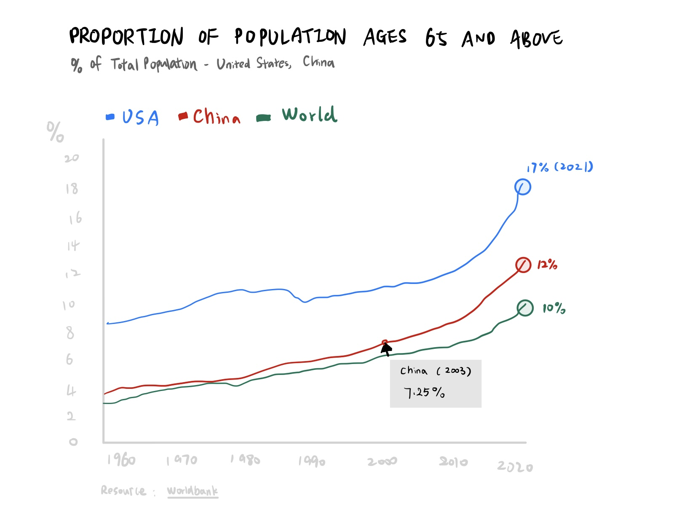

# Assignment 3 & 4: Critique by Design

## Step one: find a data visualization
<iframe src="https://data.worldbank.org/share/widget?indicators=SP.POP.65UP.TO.ZS" width='800' height='533' frameBorder='0' scrolling="no" ></iframe>

## Step two: critique the visualization

##### I. Sliding Scale (1 - 10)
Usefulness - 9

Completeness - 8

Perceptibility - 8

Truthfulness - 7

Intuitiveness - 9

Aesthetics - 7

Engagement - 9

##### II. Describe your overall observations about the data visualization here.  What stood out to you?  What did you find worked really well?  What didn't?  What, if anything, would you do differently?  

To begin with, the topic stood out to me, as it is an intuitive topic that is relevant to everyone. I think this data visualization did a great job of delivering the message effectively because it is useful to audiences, easy to understand, and will entice people to share this information with others. However, the aspects that did not work very well are accuracy and aesthetics. First, as the audience hover the mouse over the graph, the label of the % number is not accurate. All of them are round to integers, and I would change them to two decimals. Second, since this topic is illustrating human depopulation, I think the colors of blue and grey are not delivering this sense of urgency. Meanwhile, I think it would be more effective if the title can be more specific, for instance, include the range of the years. Alternatively, adding a subtitle can be helpful for readers. Moreover, the dataset can also be useful when we are comparing the data between countries, or comparing the data of one country with that of the world.

##### III. Who is the primary audience for this tool?  Do you think this visualization is effective for reaching that audience?  Why or why not?

The primary audience can be anyone, as it is a graph that shows the depopulation trend of the world. Nevertheless, when we extract data for specific countries, citizens from those countries become the narrower target audience. Meanwhile, for those who do business related to elder people, this information would be something useful to them. Overall, I think the visualization is relatively effective as the chart is simple and clear, while we do need to make some adjustments to this chart to make it more effective. And I would focus on improving the accuracy and aesthetics aspects. However, this visualization can be more effective if it can narrow down the primary audience, as the current “world” line is kind of broad, and we can use the dataset to make the topic more specific.

##### IV. Final thoughts: how successful what this method at evaluating the data visualization you selected? Are there measures you feel are missing or not being captured here?  What would you change?  Provide 1-2 recommendations (color, type of visualization, layout, etc.)

I think the method we use for this evaluation is quite successful, while I do think that there are two aspects that could be explicated more clearly. The first one would be, whether the data visualization is concise. In other words, is there anything that is irrelevant, or does not help with the illustration? The second recommendation is the measurement of the use of color. Other than the aesthetics part, is the color used in the visualization consistent with the theme of the topic discussed? Color theory and color psychology might be applied here.

## Step three: wireframe a solution

## Step four: test the solution

##### Person 1 - female, student, 20s

Q1. Can you tell me what you think this is?

A: This is the proportion of the population ages 65 and above in the USA, China, and the world as a whole.

Q2. Can you describe what you see in the first place?

A: There is an increase in the proportion of the population ages 65 and above in the USA, CHINA, and the world as a whole.

Q3. Is there anything you find surprising or confusing?

A: It surprises me that the USA has the highest proportion of the population ages 65 and above in 2021.

Q4. Who do you think is the intended audience for this?

A: I think the intended audiences could be Social Security Bureau and the census agency.

Q5. Is there anything you would change or do differently?

A: I would probably change the labels on the x-axis to every 5 years rather than 10 years.

Q6. Do you like the original version or the revised version better, why?

A: I think the revised version is better because you can see the contrast between China and the United States and the world. Also, you can see the changes in the world more clearly, as the line on the original version is relatively flat and does not reflect some of the minor changes.

 

##### Person 2 - male, adult, 30s

Q1. Can you tell me what you think this is?

A: This is the aging process in the population of the United States compared to the world's second-largest economy and the world's average.

Q2. Can you describe what you see in the first place?

A: The population of the United States is aging heavily.

Q3. Is there anything you find surprising or confusing?

A: The degree of aging in the United States fluctuated significantly between 1970 and 1990.

Q4. Who do you think is the intended audience for this?

A: I think the intended audiences are people in the defense sector, pharmaceutical industry, health insurance industry, and health care industry.

Q5. Is there anything you would change or do differently?

A: The “world” line could be used in grey color as it is not a country. Could be used as a reference line.

Q6. Do you like the original version or the revised version better, why?

A: I like the revised one because the solid line is clear and concise, and adding comparisons between countries can better explain the problem.

## Step five: build your solution

[Back to Main Page](/README.md)
