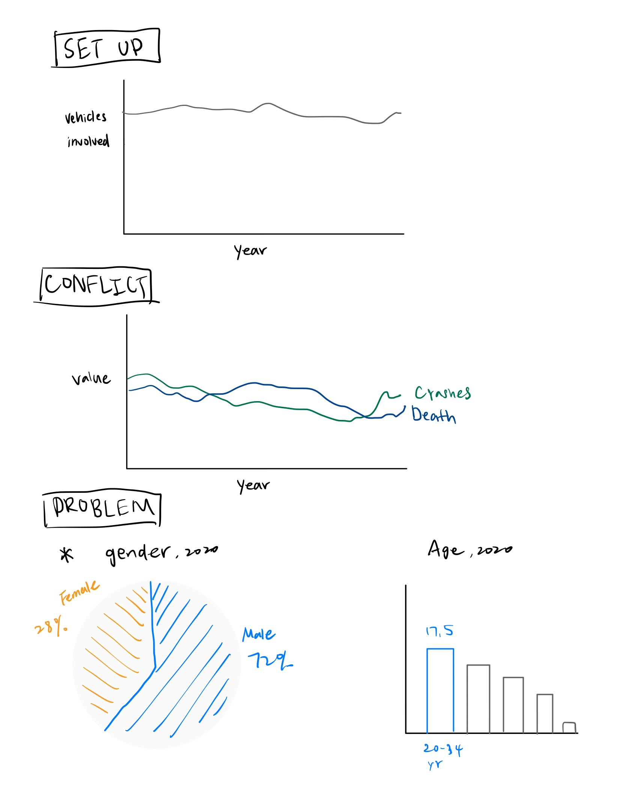

# Final Project Part 1

## Outline

##### Summary

Issue: 
This project is going to focus on telling a story about data on car accidents in the US from 2010 to 2020. In this project, I am interested in first showing the trend of car accidents in the past 10 years and then leading to the issue. The main purpose of this data visualization project is to deliver the issue that there is a rise in the number of death as well as crashes caused by car accidents.

Reason: 
After showing the trend of car accidents in the past 10 years, I will be going into detail about the possible reasons that cause the rise in the number of car accidents. For instance, gender, age, speed, time of the day, as well as distraction can all become the reasons that result in car accidents.

Solution: 
In conclusion, with data visualization, we will be able to identify what are the top three important aspects that cause car accidents, and therefore, we can give a solution to this issue of rising car accidents.

##### Project Structure

The project structure in corporates with the summary, explains how will I unfold the story.

## Initial Sketches

## [Data](https://www.iihs.org/topics/fatality-statistics/detail/yearly-snapshot)

The data source I will use is linked above. This is the data source that I found, and it has everything that I will need for the project. It does not contain much data visualization, and therefore, I will be using the data from this source to create my story. This data source is liable and has been used as a reference for other analyses.

I am going to selectively use the data from this source. Additionally, since data itself cannot be downloaded directly, I will need to create my own excel datasets using the numbers from this source to upload data to tableau and flourish.

To be more specific, I will begin with the trend table, showing the overall trend of the rising in car accidents in the past 10 years. From this chart, readers will be able to tell that there has been a notable rise since 2015 (especially 2019-2020). Then, I will be using the data from the other tables in this source to illustrate the possible reasons for the rise in the number of car accidents.

## Method and Medium

I am planning on using Shorthand as the digital platform for this project. I am also going to create a simple version of the project for the presentation. Meanwhile, I am planning on using Tableau as well as Flourish to realize the sketches that I made.

 

[Back to Main Page](/README.md)
